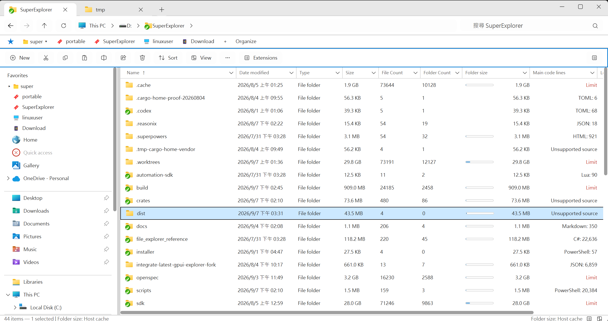

# [**SuperExplorer**](https://github.com/damody/SuperExplorer)

Roadmap status and runtime/validation handoff: [Post-parity roadmap handoff](docs/POST_PARITY_ROADMAP_HANDOFF.md).

[English](README.md) | [繁體中文](README.zh-TW.md) | [简体中文](README.zh-CN.md)

A Windows 11 file explorer written in Rust with [GPUI-CE](https://github.com/gpui-ce/gpui-ce). The project combines a native Windows shell integration layer with a custom GPUI interface inspired by Windows File Explorer.

> This project is under active development. It is Windows-only and is not a drop-in replacement for every Windows Explorer shell feature.



## Features

### Navigation and views

- Tabbed folder navigation with Back, Forward, Up, address bar, breadcrumbs, and search.
- Real folder enumeration, file-system watching, sorting, filtering, and Details / icon / thumbnail layouts.
- Session restore for tabs, pins, view settings, and window placement.
- Light, dark, and high-contrast themes; DPI-aware layout; keyboard navigation; IME input; and UI Automation semantics.

### Details columns

- Built-in columns for Name, Date modified, Type, Size, Date created, Authors, Tags, Title, File Count, Folder Count, and Permissions.
- File Count and Folder Count are visible by default on a fresh Details layout. Existing saved layouts keep their previous visibility.
- Header right-click opens a Windows 11-style column chooser: visible columns show a check mark, enabled rows can be toggled repeatedly without closing the menu, and Name stays checked and locked. Auto-size commands still dismiss the menu.
- Column reorder, resize, auto-size, and per-tab persistence.

### File operations

- Native create, rename, copy, move, delete, conflict handling, cancellation, and undo journaling.
- Windows clipboard interoperability and OLE drag-and-drop with Explorer, including copy/move across volumes and remote providers.
- Multi-transfer center with progress, speed, and cancellation.
- Process lock-owner detection and recovery when a file or folder is in use.

### Remote filesystems

- ADB (Android), SFTP, FTP, and Google Drive browsing with address-bar login where required.
- Cross-provider copy/move, remote properties and permissions, and symlink / shortcut creation where the provider supports it.
- Local APK install onto a connected Android device, with status notices.

### Search, metadata, and performance

- Folder Options → General lets you pick exactly one search engine: Everything, MFT, or file enumeration. Unsupported engines stay visible but disabled, with a hint; search never silently falls back to another engine.
- MFT-backed folder size, File Count, and Folder Count for local NTFS volumes, shared across windows through the MFT service.
- Shell icons, overlays, BC7 icon/thumbnail caches, and a Preview pane with trusted rasters or Windows Preview Handlers.

### Bookmarks, automation, and extensions

- Bookmark toolbar and manager for folders, files, and Lua commands.
- Extensible plugin platform (Rust DLL and Lua packages) for extra columns, views, and commands, including folder-size bars, Size Map, Code Lines, 7-Zip virtual folders, and lock-owner columns.
- Folder Options window for search engine, view preferences, language, extension enablement, cache budgets, and scoped session reset.

### Shell integration

- Native immersive context menus for local files, with the same visual style for application-owned popups.
- Namespace roots such as This PC, Quick Access, Libraries, ZIP, Recycle Bin, and Network where the Shell exposes them.
- Windows 11-inspired chrome, taskbar/start integration through SuperDesktop when installed, and an NSIS installer.

### Validation

- Automated unit, integration, architecture, visual, accessibility, lifecycle, and Windows interop validation scripts.

## Requirements

- Windows 11 x64.
- [Git](https://git-scm.com/) with submodule support.
- Rust `1.85.0` or newer using the `x86_64-pc-windows-msvc` toolchain.
- Visual Studio 2022 Build Tools or Visual Studio with the **Desktop development with C++** workload.
- A Windows SDK compatible with the MSVC toolchain.
- PowerShell 7 is recommended for the validation scripts.

## Get Started

Clone the repository and initialize the GPUI-CE submodule:

```powershell
git clone --recurse-submodules https://github.com/damody/file_explorer.git
cd file_explorer
```

If the repository was cloned without submodules:

```powershell
git submodule update --init --recursive
```

Build and run the application:

```powershell
cargo run -p explorer-app --locked
```

To open a specific folder at startup:

```powershell
$env:EXPLORER_INITIAL_PATH = 'D:\'
cargo run -p explorer-app --locked
```

## Release Build

Build and finalize the Windows executable, including its manifest and version resources:

```powershell
./scripts/finalize_windows_artifact.ps1 -Profile release
```

The executable is written to `target/release/SuperExplorer.exe`.

## Validation

Run the primary repository checks:

```powershell
cargo run -p explorer-uitest -- --suite quick
cargo fmt --all -- --check
cargo check --workspace --locked
cargo clippy --workspace --all-targets --locked -- -D warnings
cargo test --workspace --locked
```

The manifest-driven runner scans every active OpenSpec requirement and fails validation when a
requirement has no mapped regression case. Run headful and native integration coverage with:

```powershell
cargo run -p explorer-uitest -- --suite full --fail-on-skip
cargo run -p explorer-uitest -- --suite interop --fail-on-skip
```

Headful Windows and visual checks require an interactive desktop session. Useful entry points include:

```powershell
./scripts/run_headful_validation.ps1 -SkipBuild -OutputDirectory target/headful-evidence/local
./scripts/capture_dpi_matrix.ps1 -OutputDirectory target/dpi-evidence/local
./scripts/check_architecture.ps1
./scripts/check_ui_tokens.ps1
```

See [Explorer UITest](docs/UITEST.md), [Manual Tests](docs/MANUAL_TESTS.md), and
[Visual Testing](docs/VISUAL_TESTING.md) for the complete workflows.

## Workspace Layout

| Path | Responsibility |
| --- | --- |
| `crates/explorer-app` | Application startup, Windows prerequisites, MFT service, and GPUI composition root |
| `crates/explorer-common` | Shared diagnostics and error types |
| `crates/explorer-i18n` | Embedded Fluent catalogs and locale negotiation |
| `crates/explorer-jobs` | Background job coordination |
| `crates/explorer-model` | Navigation, operations, window, and domain models |
| `crates/explorer-mft` | NTFS MFT index and folder-aggregate queries |
| `crates/explorer-remote` | ADB, SFTP, FTP, and Google Drive providers |
| `crates/explorer-search` | Query parsing and search engine |
| `crates/explorer-shell-win` | Native Windows Shell, clipboard, OLE, immersive popups, icons, and file operations |
| `crates/explorer-ui` | GPUI interface, state, layout, themes, and interaction |
| `crates/explorer-extension-host` | Plugin loading, package validation, and contribution runtime |
| `crates/explorer-extension-broker` | Isolated broker/worker for Shell providers and Preview Handlers |
| `crates/explorer-test-support` | Shared test fixtures and helpers |
| `crates/explorer-uitest` | Manifest-driven OpenSpec coverage and regression runner |
| `vendor/gpui-ce` | Pinned GPUI-CE Git submodule |
| `SuperDesktop` | Optional desktop-shell companion (submodule; not modified by ordinary app commits) |
| `scripts` | Build, smoke-test, interop, accessibility, and visual-validation scripts |
| `docs` | Status, evidence, testing guides, and implementation notes |

## Project Documentation

- [Current status](docs/STATUS.md)
- [Final handoff and known gaps](docs/FINAL_HANDOFF.md)
- [Parity matrix](docs/PARITY_MATRIX.md)
- [Checkpoint evidence](docs/CHECKPOINT_EVIDENCE.md)
- [Implementation plan](docs/IMPLEMENTATION_PLAN.md)

## Known Limitations

- The application currently targets Windows only.
- Preview Handler rendering, cloud availability, Network discovery, and third-party namespace/handler behavior depend on the installed Windows environment.
- Some OLE drag-and-drop, mixed-DPI, Narrator, and Explorer-to-app scenarios still need manual validation on a real interactive Windows desktop.
- Search uses the engine selected in Folder Options. Everything needs the packaged SDK and IPC; MFT needs a local NTFS volume with a SuperExplorer MFT index; file enumeration needs a local folder. Remote locations cannot use these engines.
- Saved Details layouts keep their previous column visibility; File Count and Folder Count default to visible only on a fresh layout.

See [Final Handoff](docs/FINAL_HANDOFF.md) for the detailed validation state and remaining gaps.

## Licensing and contributions

SuperExplorer is **proprietary, source-available software**. It is not open-source software. You may inspect the source and prepare contributions or compatible plugins only under the applicable documents below; unauthorized redistribution, publication of modified core versions, and commercial use of the core are prohibited.

- [EULA](docs/EULA.md)
- [Plugin SDK License](docs/PLUGIN-SDK-LICENSE.md)
- [Contributing guide](docs/CONTRIBUTING.md)
- [Contributor License Agreement](docs/CLA.md)
- [Plugin Publishing Agreement](docs/PLUGIN-PUBLISHING-AGREEMENT.md)

Third-party components, including materials under `vendor/`, `third_party/`, and `build/tools/`, remain governed by their own license and notice files.
