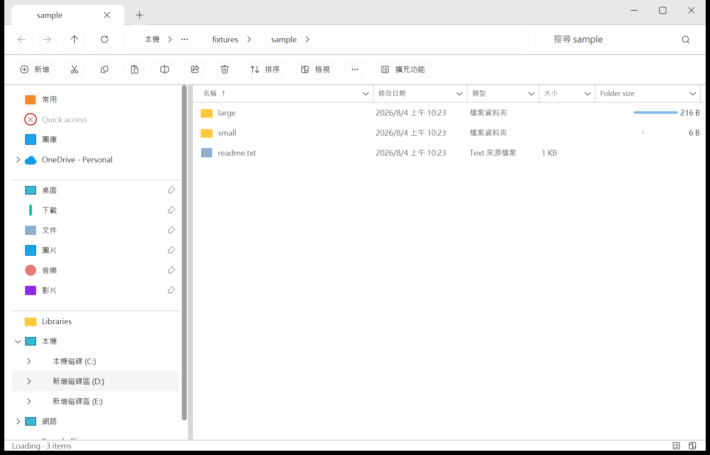

# Rust 資料夾大小視覺欄範例

這個最小範例以 Rust 與 `abi_stable` 提供資料夾大小欄位。第三方來源不會
提交或追蹤在 repository 內；建置、驗證與封裝使用預先填好的本機 Cargo
registry cache，並以鎖定依賴的 `--offline` 執行。若 cache 缺少鎖定來源，
必須先完成核准的本機 bootstrap；不可因而開啟網路或加入 vendor 目錄。

```powershell
$pluginRoot = 'sdk/fixtures/rust-folder-size-visual-column'
$cargoConfig = powershell -NoProfile -ExecutionPolicy Bypass -File sdk/scripts/prepare-local-cargo-source.ps1 -PluginRoot $pluginRoot
cargo test --manifest-path "$pluginRoot/Cargo.toml" --locked --offline --config $cargoConfig
powershell -NoProfile -ExecutionPolicy Bypass -File sdk/scripts/validate-plugin.ps1 -PluginRoot sdk/fixtures/rust-folder-size-visual-column
powershell -NoProfile -ExecutionPolicy Bypass -File sdk/scripts/build-plugin.ps1 -PluginRoot sdk/fixtures/rust-folder-size-visual-column
powershell -NoProfile -ExecutionPolicy Bypass -File sdk/scripts/package-plugin.ps1 -PluginRoot sdk/fixtures/rust-folder-size-visual-column
```

`.sepack` 會輸出至範例的 `dist` 目錄。要修改外觀，可編輯
`FolderSizeRenderer::render` 的文字與比例條，再重跑上列四個本機命令。
manifest 分別保留 `column`、`recalculate`、`settings` feature 身分，且只宣告
registrar 真正實作的 ABI root、column 與 renderer contribution。

完成且穩定的精確值最多快取 256 筆，位置為
`%LOCALAPPDATA%\RustGpuiExplorer\plugins\rust-folder-size-visual-column\folder-size\v1`。
目錄修改日期或計量限制改變時會重新在背景掃描；partial/error 不會寫成精確快取。
前景時間提示不會終止已開始的遞迴計算；完成結果會留在 Plugin 自己的快取，
下次程序啟動時若目錄 identity、修改日期與設定相同便直接載入。


